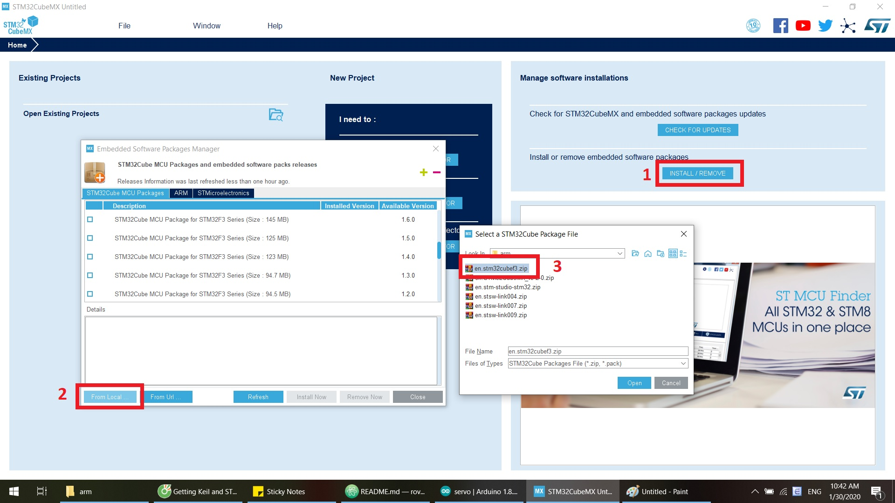

# Control single underwater thruster with STM32 MCU & PCA9685

# 1. BOM
| Quantity |                      Name                       |      Link     |
| :-------:|-------------------------------------------------| --------------|
| 6        | Underwater thuster from part 1_1 | https://github.com/hieplchan/rov_controller/tree/master/1_1_thruster_test |
| 1        | PCA9685 16-Channel 12-bit PWM/Servo Driver - I2C interface | https://hshop.vn/products/mach-xuat-16-xung-pwmgiao-tiep-i2c |
| 1        | STM32F3 Discovery Kit | https://hshop.vn/products/kit-stm32f3-discovery |

- Note:
  - **STM32F3 Discovery Kit** have onboard sensor: L3GD20 (gyroscope) & LSM303DLHC (magnetic + acceleration) - very convenient for making 9 DoF IMU without external sensor.
  - With **PCA9685** we can easily control **multiple** underwater thruster with I2C interface - use can also direct use STM32F3 PWM output pin but it's not necessary.

# 2. Step by step
## 2.1 Install necessary software
- MDK v5 (Free Lite with 32K code size is enough): http://www2.keil.com/mdk5/install/
- STM32CubeMX (need to create free ST account): https://www.st.com/en/development-tools/stm32cubemx.html
- STM32CubeF3 (follow image guide): https://www.st.com/en/embedded-software/stm32cubef3.html
- STM Studio: https://www.st.com/en/development-tools/stm-studio-stm32.html

  

## 2.2 Wire diagram

## 2.3 PCA9685 basic explained

## 2.4 Test single thruster

## 2.5 Test multiple thruster

# 3. Result
