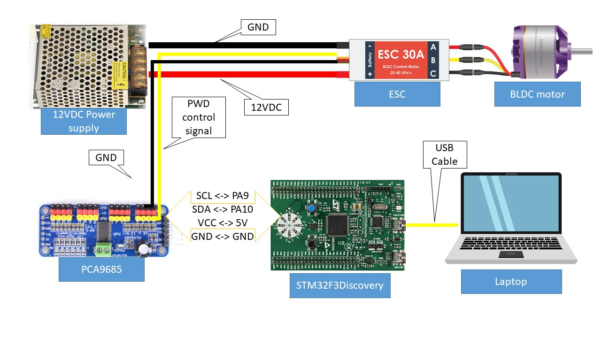
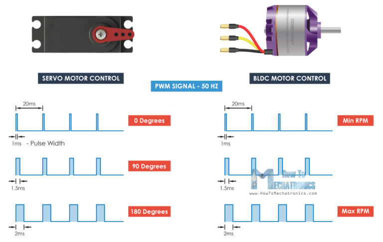
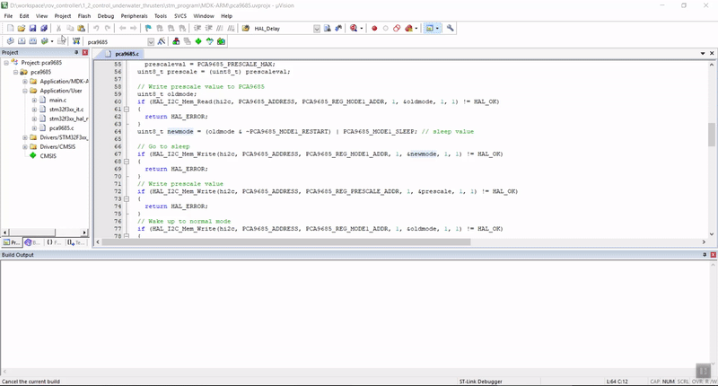
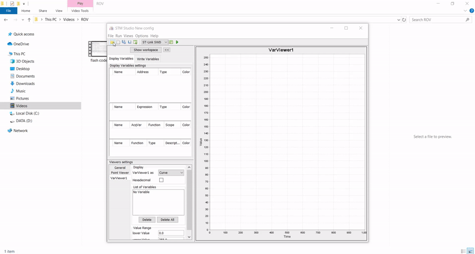

# Control underwater thrusters with STM32 MCU & PCA9685

  

# 1. BOM
| Quantity |                      Name                       |      Link     |
| :-------:|-------------------------------------------------| --------------|
| 6        | Underwater thuster from part 1_1 | https://github.com/hieplchan/rov_controller/tree/master/1_1_thruster_test |
| 1        | PCA9685 16-Channel 12-bit PWM/Servo Driver - I2C interface | https://hshop.vn/products/mach-xuat-16-xung-pwmgiao-tiep-i2c |
| 1        | STM32F3 Discovery Kit | https://hshop.vn/products/kit-stm32f3-discovery |

- Note:
  - `STM32F3 Discovery Kit` have onboard sensor: L3GD20 (gyroscope) & LSM303DLHC (magnetic + acceleration) - very convenient for making `9 DoF IMU` without external sensor.

# 2. Step by step
## 2.1 Install necessary software
- MDK v5 (Free Lite with 32K code size is enough): http://www2.keil.com/mdk5/install/
- STM Studio: https://www.st.com/en/development-tools/stm-studio-stm32.html

## 2.2 Wire diagram

  

## 2.3 ESC explained

  

Simple step to control Brussless Motor ESC () & Servo
- Step 1: Generate **50Hz** PWM pulse (20ms period)
- Step 2: Setting ESC to reconize Max forward (2ms pulse), Neutral (1.5ms pulse) & Max backward (1ms pulse)
- Step 3: Control the **high pulse duration** to control our thruster

You can direct use STM32F3 PWM output pin to control Motor but with `PCA9685` we can easily control **multiple** underwater thruster with only **one I2C** interface.

## 2.4 PCA9685 explained
- PCA9685_Init(): Initialize PCA9685 board
- PCA9685_Set_PWM_Freq(): set frequency of output pulse, we want it to be 50Hz (in 2.3)
- Servo_Set_Throttle(channel, throttle):
  - channel: PCA channel you want to control (0 -> 15)
  - throttle: from -100 (max backward) to 100 (max forward), 0 is neutral point

For detail, you can read [PCA9685 Datasheet](https://pdf1.alldatasheet.com/datasheet-pdf/view/424208/NXP/PCA9685.html) or take a look at my code (stm_program)

## 2.5 Test on thruster
- Step 1: use KeilC to flash code to STM32F3

  

- Step 2: use STMStudio to set throttle

  

- Step 3: use to  ESC Manual **Setting Throttle Range**: https://cdn-global-hk.hobbyking.com/media/file/750066771X177509X21.pdf

- Step 4: enjoy!!!

- For multi thruster, you just need to plug ESC into PCA9685 board.

# 3. Result
- Test 5 underwater thruster [result link](https://drive.google.com/drive/u/1/folders/1xnDEEL-VJsIppaNRASAbsfVeFU7DwyFn)
